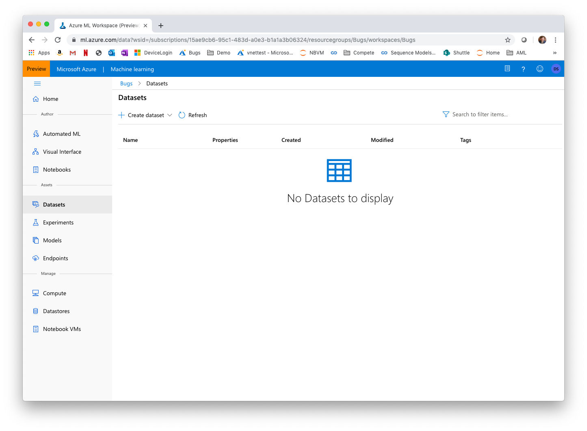
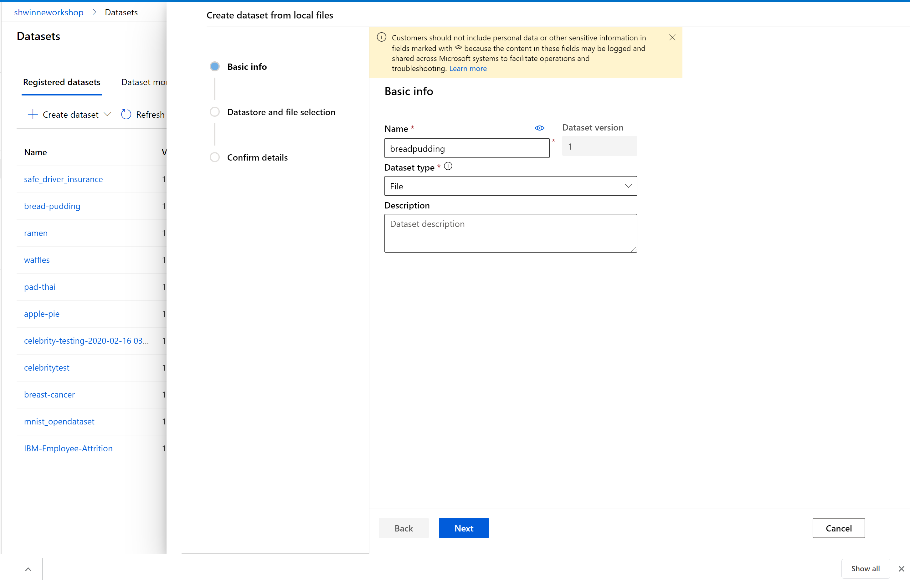
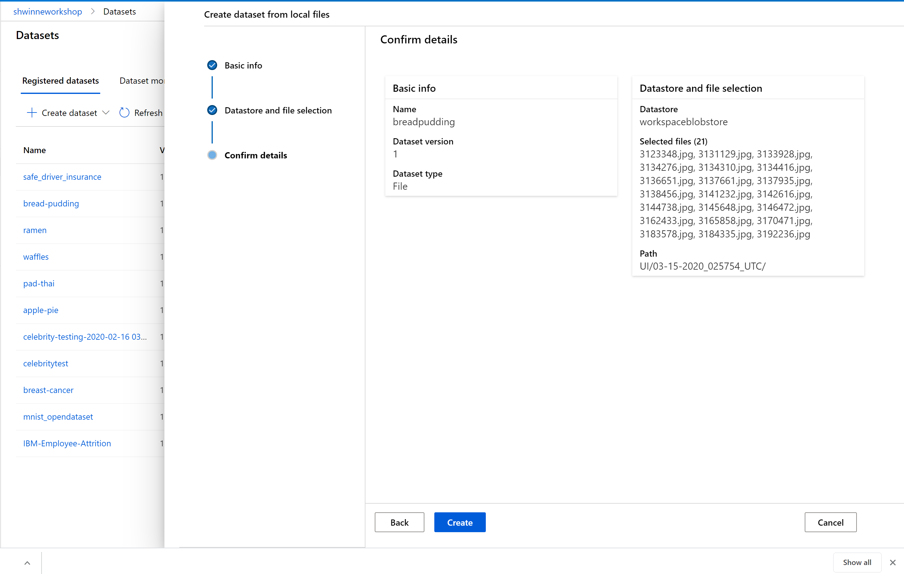

#Food 101 dataset
We are going to use the Food 101 dataset (https://www.kaggle.com/kmader/food41#1028787.jpg ) which features 101 food categories, with 101'000 images. For each class, 250 manually reviewed test images are provided as well as 750 training images. For the purpose of this notebook, we will be classifying amongst 5 different food categories (applie pie, waffles, padthai, bread pudding and ramen). We will be using only 200 images per food category. We will use a training set of 160 images and a validation set of 60 images for each class of food.

The images are located in the 'data' folder. Each subfolder represents the class of food that you will classify. To register this data as an AML dataset, please read the 'prepare-dataset.md' file located in this folder.

# Datasets and Datastores

The AzureML studio allows the user to manage their dataset and datastores directly inside the portal. 

A Dataset is a resource for exploring, transforming and managing data in Azure Machine Learning. 
Datasets enable:

- Easy access to data: without worrying about connection strings or data paths. Only keep a single copy of data in the storage service of your choice.

- Training with big data: seamless integration with Azure Machine Learning features like labelling, training products and pipelines. Users can share and reuse datasets in various experiments.

- Tracking data usage: Azure ML automatically tracks which version of the dataset was used for the ML experiment and produced which model.

## Uploading a Dataset to AzureML studio

1. Download the images in the data folder locally. 

2. Navigate to the left pane of your workspace. Select Datasets under the Assets section.

3. Click on 'Create dataset' and choose 'From local files'. Name the dataset for example 'bread-pudding' and then click 'Next'. Make sure to leave the dataset type as File.(You will need to do this for each class of food that you will like to classify.)

4. Click 'Browse', choose the image files you had downloaded for that class of food, and click 'Next' to create the dataset in the workspace's default Blob storage.

5. Click 'Next' and select 'Create' in the "Confirm Details" section. 

For more information on datasets, see the how-to for more information on creating and using Datasets. https://docs.microsoft.com/en-us/azure/machine-learning/service/how-to-create-register-datasets
